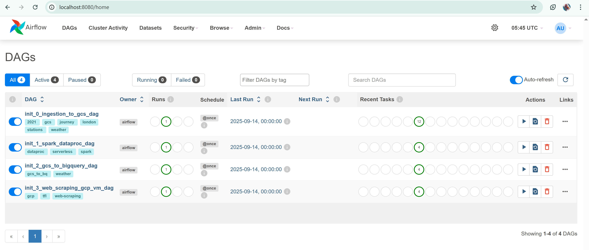

# Wheels in Motion Analytics
*Note: This project is still under development*

## Overview

This project turns Transport for London (TfL) bike-rental files into clean, analysis-ready tables in BigQuery. It uses Terraform to manage cloud resources provisioning, Airflow to schedule work, Dataproc Serverless (Spark) to transform data, Cloud Storage (GCS) to stage files, BigQuery for the final analytics layer, and Looker Studio for visualization.

## Objective

To analyze and understand how weather conditions, station characteristics, and time factors influence bicycle rental demand in London. The goal is to identify key patterns and relationships that can help predict rental usage and optimize resource allocation.

To achieve this, I built a reliable, repeatable pipeline from web → raw files → cleaned datasets → BigQuery.

   Produce a simple star-schema for analysis and dashboards:
   
   fact_journey (rides)
   
   dim_station (stations)
   
   dim_datetime (time attributes)
   
   dim_weather (daily weather)

## Datasets Used
1) Weekly journey files (actual rides)
   I scraped the TfL cycling data page to collect links under usage-stats/, then downloaded each weekly CSV.
   Source: [Transport for London (TfL)](https://cycling.data.tfl.gov.uk/) 
    (the homepage I scraped to build links_dictionary.json), which points to files like usage-stats/17Mar2021-23Mar2021.csv.

2) Docking stations (station lookup/dimension)
   CSV of docking stations (IDs, names; coordinates may be refined later).
   Source (direct download link): [here](https://www.whatdotheyknow.com/request/664717/response/1572474/attach/3/Cycle%20hire%20docking%20stations.csv.txt)

3) Daily weather (weather dimension)
   JSON of daily weather, normalized in the pipeline to an array of day records.
   Source (direct download link): [here](https://docs.google.com/uc?export=download&id=13LWAH93xxEvOukCnPhrfXH7rZZq_-mss)

### Process (two significant steps)
The project was segregated into two broad sections, containing two sets of scripts.

#### 1) Bootstrap (setup and test, Upload helper scripts)

It sets up the environment so the Airflow containers and connections can talk to GCP using the right credentials and settings.
Then it downloads the TfL files, cleans the weather JSON, uploads data and scripts to GCS, and runs a Dataproc Serverless job to write processed Parquet files.

The scripts are below:

1) init_0_ingestion_to_gcs_dag – Download seed files (stations, weather, one sample journey), normalize weather.json, and upload data + Spark scripts to GCS.
      
2) init_1_spark_dataproc_dag – Run a small Dataproc Serverless job to write stations and weather to Parquet in processed/….
      
3) init_2_gcs_to_bigquery_dag – Load processed weather into BigQuery as dim_weather.
      
4) init_3_web_scraping_gcp_vm_dag – Crawl the TfL site and save a manifest (links_dictionary.json) of weekly journey CSV links to GCS.

*Note: only this first section has been completed as of 18/09/2025. See the Airlow WebObserver UI below*

*Figure 1: Sample of Airflow runs.*

#### 2) Production (real data flow) 

*Note: Scripts below are under development as of 18th of Sept. 2025*

Section 2 (Transform)
It waits until Step 1 finishes, then creates a Dataproc Serverless batch with PySpark script and settings.
It reads raw files from GCS, transforms them, and writes clean Parquet data to the processed folder, using the staging bucket for temp file.

The scripts are below:

1) proc_0_ingestion_to_gcs_dag – Use the manifest to download the real weekly journey CSVs to GCS raw/.
   
2) proc_1_spark_dataproc_serverless_dag – Run the journey transform script to:
   
         create processed/cycling-fact/journey/ (fact),
         
         create processed/cycling-dimension/datetime/ (datetime dim),
         
         and augment processed/cycling-dimension/stations/ if new station IDs appear.

3) proc_2_gcs_to_bigquery_dag – Load Parquet from GCS to BigQuery tables: dim_station, dim_datetime, fact_journey (overwrite for a clean, idempotent load).

### Expected Outputs

   BigQuery tables: dim_weather, dim_station, dim_datetime, fact_journey.

### GCS directory layout:

   raw/… (downloaded weekly CSVs)
   
   processed/cycling-dimension/{stations, datetime, weather}/
   
   processed/cycling-fact/journey/
   
   utils/scripts/*.py, links_dictionary.json (manifest)

## Steps to Run the Project
### 1) Requirements
   Create a GCP project and enable APIs such as Cloud Storage JSON, BigQuery, DataProc, Compute Engine APIs
   Make sure your Google account has owner role for the project
   Install Docker, Docker Compose, Terraform and Git on your VM or local machine

### 2) Clone this Repo
      git clone https://github.com/Ola-20/Wheels-in-Motion-Analytics.git

### 3) Terraform
Terraform will be used to setup infrastucture for the project
   
   Navigate to Terraform Folder
    
    cd terraform

   Then run the following in sequence:
    
    terraform init
    
    terraform plan
    
    terraform apply

Check your Google Cloud Console 
You should see:

   A new Cloud Storage bucket

   A BigQuery dataset

   Dataproc service enabled

   IAM roles and service accounts created

### 4) Start Airflow and Run the Pipeline

Once Terraform has created the GCP resources, use the airflow folder in this repo to run the pipelines with Docker.

##### 4.1 Go to the Airflow folder

    cd airflow

   This folder contains:

      docker-compose.yaml – runs Airflow (webserver, scheduler, Postgres)

      Dockerfile / image config

      dags/ – all DAGs

      dags/scripts/ – PySpark / helper scripts

      requirements.txt – Python deps for Airflow

##### 4.2 Configure environment variables

   Create a .env file inside the airflow folder and set the key values:

      GCP_PROJECT_ID=your-project-id

      GCS_BUCKET=your-data-bucket-name

      BQ_DATASET=your-dataset-name

      BQ_LOCATION=australia-southeast1

Make sure these match what Terraform created. so check the terraform to confirm the names you might have edited based on your GCP project name.

##### 4.3 Build and start Airflow
   Build the Airflow image
      
      docker-compose build

   Start Airflow (webserver, scheduler, db)

      docker-compose up -d

##### 4.4 Access the Airflow UI

   Open your browser and go to:
      
      http://localhost:8080

   Log in with the credentials defined in docker-compose.yaml (often airflow / airflow for local).

   You should now see all DAGs from airflow/dags/ which are of two sets:

      init_... DAGs (initial ingest/setup)

      proc_... DAGs (processing & load to BigQuery)

##### 4.5 Run the pipeline

   In Airflow:

   Turn ON (unpause) the DAGs you want to use.

   Manually trigger in order for a first run:

      init_0_ingest_to_gcs (or your equivalent)

      proc_1_spark_dataproc_serverless_dag

      proc_2_gcs_to_bigquery_dag

   Confirm in:

      GCS: raw + processed folders populated

      BigQuery: dim & fact tables created and filled

NOTE: After confirming all the tables, I created a materialised table that combines all the needed columns from the 4 tables called "journeys_enriched" so that i can have a faster response on my visualisation, this is optional.

### 5) Build and View the Dashboard in Looker Studio

Once data is loaded into BigQuery, you can connect Looker Studio to start visualising your cycling-journey data.

##### 5.1 Open Looker Studio

Go to https://lookerstudio.google.com

Sign in with the same Google account used for your GCP project.

##### 5.2 Create a New Report

   Click “Blank report.”

   Select BigQuery as your data source.
   
   Choose your project → dataset (cycling_analytics) → select the table journeys_enriched (or any dim/fact table you prefer).

   Click Add → Add to report.

##### 5.3 Create and Customise Your Dashboard

   Add charts and edit as needed: 

   Set a background color or image for visual appeal.

   The sample chart below illustrates the distribution of station names, bicycle models, and peak rental periods, providing valuable insights for data-driven decision-making and resource optimization

*Figure 2: Analytics dashboard showing station usage and peak rental times.*

## Project Structure Summarised

This repository is organised into folders that separate infrastructure, data pipelines, and scripts, making it easy to follow and maintain.

Wheels-in-Motion-Analytics/
│

├── terraform/                # Infrastructure as Code (IaC)

    ├── main.tf               # Defines GCP resources (buckets, BigQuery, Dataproc, etc.)

    ├── variables.tf          # Input variables for resource names and locations

    ├── outputs.tf            # Outputs (e.g., bucket names, dataset IDs)

    └── provider.tf           # Google provider configuration

├── airflow/                  # Workflow orchestration environment

    ├── dags/                 # Contains DAG definitions and transformation logic

    │   ├── init_*.py         # Initial ingestion DAGs

    │   ├── proc_*.py         # Processing and load-to-BigQuery DAGs

    │   └── scripts/          # Python scripts used inside the DAGs

    │       ├── journey-data-transformation.py

    │       └── weather-data-transformation.py

    ├── docker-compose.yaml   # Spins up Airflow webserver, scheduler, and DB

    ├── Dockerfile            # (Optional) Custom Airflow image

    ├── requirements.txt      # Python dependencies for Airflow environment

    └── .env                  # Environment variables (project, bucket, dataset)

├── README.md                 # Documentation and setup guide

└── .gitignore                # Git ignore rules (logs, creds, compiled files)

## OVERVIEW: HOW TO REPRODUCE THE PROJECT

You can fully reproduce this end-to-end pipeline by following these high-level steps:

a) Fork or clone this repository to your own GitHub account.

b) Set up GCP and create your own project (enable APIs, create a service account, and assign owner permissions).

c) Run Terraform to automatically provision Cloud Storage, BigQuery, and Dataproc.

d) Deploy Airflow (Docker Compose) and trigger the DAGs (proc_0 → proc_1 → proc_2).

e) Validate your BigQuery tables, then create the vw_journeys_enriched view and the journeys_enriched materialised table.

f) Connect Looker Studio to the table and explore the data visually.

g) To extend it → modify the PySpark scripts to include new metrics, or add a new DAG to automate data refresh
